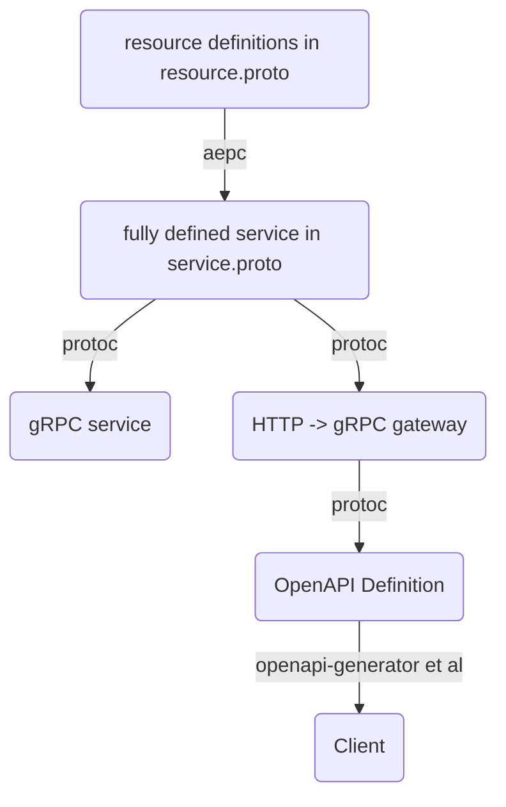

# aep-sandbox design

The following diagram represents the components in both the generation and
runtime of services built on the the aep toolkit.

```mermaid
graph TD
    resource("resource definitions in resource.proto")
    serviceProto("fully defined service in service.proto")
    gService("gRPC service")
    httpService("HTTP -> gRPC gateway")
    OpenAPI("OpenAPI Definition")
    client("Client")
    resource -- aepc --> serviceProto
    serviceProto -- protoc --> gService
    serviceProto -- protoc --> httpService
    httpService -- protoc --> OpenAPI
    OpenAPI -- openapi-generator et al --> client
```