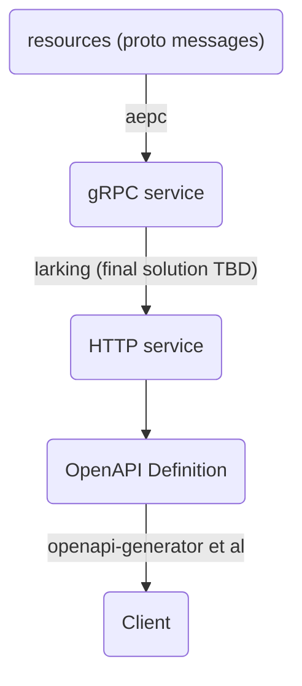

```mermaid
graph TD
    resource("resources (proto messages)")
    gService("gRPC service")
    httpService("HTTP service")
    OpenAPI("OpenAPI Definition")
    client("Client")
    resource -- aepc --> gService
    gService -- "larking (final solution TBD)" --> httpService
    httpService --> OpenAPI
    OpenAPI -- openapi-generator et al --> client
```